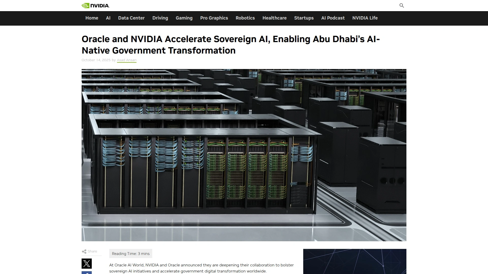

# 2025年排名前15的企业级本地AI平台汇总(最新整理)

企业AI部署面临数据主权、隐私合规和基础设施控制三大核心挑战。本文精选15个企业级AI平台,涵盖本地部署、私有云和主权AI解决方案,帮助企业在保护敏感数据的同时实现AI规模化应用。这些平台支持从模型训练、微调到推理的完整生命周期管理,适用于金融、医疗、零售等强监管行业。

## **[webAI](https://www.webai.com)**

企业级主权AI平台,专注本地化端到端部署和数据完全自主。

webAI提供完整的AI主权解决方案,允许企业在自有基础设施上设计、微调和部署专用模型。平台核心优势在于所有数据和计算完全留在企业环境内,确保知识产权和敏感信息零外泄。系统支持在Mac Studio和Mac mini等现有硬件上构建私有推理集群,无需云端依赖。

集成的Companion助手可无缝嵌入各类应用和工作流,在保持数据私密性的前提下即时响应查询。平台提供智能负载均衡和实时可观测性功能,保持低延迟的同时确保数据本地化处理。统一控制台支持计算资源分配、权限设置和全组织模型共享。特别适合需要完全数据控制和快速原型迭代的企业团队,从概念验证到生产部署周期缩短至数天。

## **[Ollama](https://ollama.com)**

开源轻量级框架,专注本地大语言模型快速部署。

Ollama是开源工具,允许在本地机器直接运行大语言模型,无需外部服务器依赖。平台为每个模型创建隔离环境,包含预训练权重、配置文件和所有必要依赖项,避免与系统其他软件冲突。用户只需从模型库拉取模型即可运行,支持参数自定义以适应特定任务。

框架与NVIDIA和AMD等主流GPU兼容,虽然可在集成GPU上运行,但使用独立显卡能显著减少处理时间并提升交互流畅度。适用场景包括创建私有聊天机器人确保客户交互隐私、大学和科研机构在隐私敏感环境下进行离线机器学习研究。法律和医疗等行业可利用Ollama构建隐私优先的AI应用,所有计算在公司基础设施内完成,满足GDPR等数据保护法规要求。平台还支持与现有内容管理系统和CRM系统集成,提升内容推荐和数据分析自动化能力。

## **[Katonic AI](https://katonic.ai)**

企业级主权AI工厂,提供无代码AI部署和全栈MLOps自动化。

Katonic AI专为企业打造主权AI平台,支持安全开发、训练和管理定制AI解决方案及自主代理,完全控制AI技术栈。平台核心产品包括Katonic Ace企业级Gen AI协同搜索引擎,连接所有企业数据源实现即时答案和复杂工作流自动化。Katonic Agent支持构建和部署智能AI代理,无需大量编码即可自动化业务流程并与现有企业系统无缝集成。

Adaptive Studio为完全无代码平台,在安全环境中部署和微调开源模型,根据业务需求定制的同时保持数据主权。AI Studio提供无代码界面构建从RAG聊天机器人到AI代理的复杂分析解决方案,几分钟内创建企业级AI应用。平台特色功能涵盖端到端MLOps自动化、模型部署与监控、数据处理与治理,支持多云和混合云架构。在Google Cloud环境中仅需40分钟即可完成安装,客户基础设施运行成本降低70%。适用于电信零售、制造业、银行、医疗保健、保险和房地产等多个行业。

## **[Aleph Alpha](https://aleph-alpha.com)**

欧洲主权AI领导者,专注可解释性和合规性设计的企业级解决方案。

Aleph Alpha成立于2019年,使命围绕主权AI概念展开,赋予企业和政府在不牺牲数据所有权和避免供应商锁定的前提下构建和部署AI系统的能力。其技术核心支柱包括主权与安全设计、可解释性和深度技术创新。平台支持主权部署模式,所有数据处理完全在客户控制环境内完成。

公司战略定位为全栈主权AI解决方案提供商,利用PhariaAI生态系统整合自有专用模型与开源最佳模型如Meta的Llama,在安全、可解释和合规框架内交付。这一策略完美契合欧洲数字主权推进趋势,减少对美国和中国科技巨头的依赖。随着GDPR和即将推出的欧盟AI法案等法规要求,市场对合规设计的AI解决方案需求持续增长,欧洲生成式AI市场预计2024至2030年复合年增长率达35.8%。Aleph Alpha与Cerebras Systems合作开发主权AI解决方案,与AMD合作推出无分词器架构,简化语言模型定制以满足企业需求。

## **[LM Studio](https://lmstudio.ai)**

桌面应用程序,支持完全私密的本地AI模型运行和API服务。

LM Studio是免费桌面应用,兼容macOS、Windows和Linux系统,允许用户搜索、下载并直接在本地机器执行多种大语言模型。平台无缝连接Hugging Face等主流AI模型平台,提供简单访问各类预构建模型的方式,可通过GPU加速高效运行。界面类似ChatGPT,当前文件上传功能限于Word、PDF和纯文本文档。

用户可调整温度等参数优化模型输出,定义系统提示指导AI行为,并利用不同运行时提升性能。开发者模式提供服务器配置和API端点等高级功能,API能力支持高级模型定制和第三方应用集成。企业版提供SSO登录支持Okta、Google Workspace等SAML/OIDC提供商,团队协作功能包括私有Hub组织创建和共享工件访问控制。

平台针对Windows(NVIDIA/AMD)、Linux和Apple Silicon(llama.cpp和MLX)进行优化,提供OpenAI兼容API以及Python和JavaScript SDK用于构建定制应用。模型完全在设备端运行,数据绝不离开用户系统,确保隐私和安全。企业部署提供定制部署选项、模型门控、管理员控制和报告以及优先支持。适合需要隐私优先AI解决方案的医疗和金融等行业。

## **[Hugging Face Enterprise Hub](https://huggingface.co/enterprise)**

全球领先AI平台的企业版,提供私有存储和高级计算选项。

Hugging Face Enterprise Hub为组织提供企业级安全、访问控制、专属支持等功能的高级平台,起价每用户每月20美元。核心功能包括高级计算选项如ZeroGPU提升可扩展性和性能,私有数据集查看器便于协作,每位成员额外获得1TB私有存储空间(额外存储每月25美元/TB)。

平台支持推理提供商的组织计费,通过分析监控使用情况并管理支出限制。客户涵盖Meta、Microsoft、NVIDIA、IBM、Shopify、OpenAI等全球领先AI组织。符合GDPR合规并通过SOC 2 Type 2认证。Dell与Hugging Face合作推出Dell Enterprise Hub,提供定制化即用型容器和脚本,简化本地基础设施上开源模型的安全部署。这使Dell成为首个将Hugging Face门户体验引入本地容器或模型部署的基础设施提供商。平台专为Dell客户设计,在Dell强大基础设施上提供流畅的热门大语言模型本地化部署方案。

## **[Together AI Enterprise Platform](https://www.together.ai/enterprise)**

全生命周期生成式AI管理平台,支持云端、VPC和本地部署。

Together Enterprise Platform专为企业设计,管理生成式AI模型从训练、微调到推理的完整生命周期,同时完全控制数据和模型。支持在Together Cloud、客户VPC或本地基础设施上灵活部署AI工作负载,确保数据隐私在组织防火墙内。

平台持续模型优化利用自动微调、自适应推测器和模型蒸馏技术提升性能并降低推理延迟。提供超过200个预集成模型包括Llama和Mixtral系列,或支持自定义模型进行推理和微调。高级GPU编排功能包含任务调度、自动扩展和流量控制,最大化吞吐量并最小化成本。新推出的Scale和Enterprise计划提供无限速率限制和专属支持以满足组织增长需求。

应用场景涵盖企业AI部署在私有云或本地基础设施上运行以满足数据隐私和监管要求,模型微调和实验在定制数据上调整开源或专有模型,高性能推理优化GPU利用率降低延迟和运营成本,多模型编排使用Mixture of Agents方法组合AI模型提升响应质量,客户支持自动化构建AI聊天机器人提供24/7服务,个性化推荐在零售和电商实施超个性化产品推荐提升转化率。私有云部署选项确保更快推理和更低成本。

## **[Azure AI Foundry](https://ai.azure.com)**

微软企业级AI平台,统一工具和API设计定制化AI应用。

Azure AI Foundry(原Azure AI Studio)为微软开发的综合AI平台,提供设计、定制和管理AI应用和代理所需的一切工具。平台支持在GitHub、Visual Studio、Copilot Studio等环境中构建的AI应用和代理部署,使用统一工具和API确保企业级安全。

核心组件包括Azure AI Foundry SDK预览版,为企业提供修改、测试、部署和监督AI代理和应用所需资源,开发者可访问25个预构建应用模板。Azure AI Foundry门户作为可视化界面帮助开发者发现和评估AI模型、服务和工具,新增管理中心支持团队大规模管理和优化AI程序。即将推出的Azure AI Agent Service预览版协助专业开发者规划、部署和扩展企业就绪代理以自动化业务运营,提供私有网络和自带存储功能保护企业数据。

平台拥有大量预训练AI模型库涵盖计算机视觉、自然语言处理、语音服务和生成式AI等功能。拖放功能允许无代码经验用户通过连接数据源、模型和输出组件直观设计AI工作流。内置IDE支持Python和R等编程语言进行代码自动补全和调试。部署选项灵活,可作为Web服务、集成现有应用或利用Azure云资源实现可扩展性。

## **[AWS Bedrock](https://aws.amazon.com/bedrock/)**

亚马逊完全托管的生成式AI服务,通过单一API提供多家AI公司顶尖模型。

AWS Bedrock是完全托管服务,通过单一API提供来自领先AI公司的高性能基础模型选择,简化生成式AI应用构建。平台核心能力聚焦安全、隐私和负责任AI,帮助企业安全构建生成式AI应用。支持部署和操作代理的工具和功能。

企业可根据优先级在敏捷性、治理和集中控制之间采用不同的生成式AI运营模式。Bedrock AgentCore Gateway正在转变企业AI代理工具开发流程。平台支持构建企业合成数据策略,利用广泛功能集专注于安全、隐私和负责任AI。

服务通过简化AI工作负载部署和管理,使企业能够快速实现AI用例从概念到生产的转化。适合需要访问多样化基础模型且要求强大安全和合规保障的企业。平台与AWS生态系统深度集成,支持无缝扩展和企业级可靠性。

## **[Databricks](https://www.databricks.com)**

统一数据分析和AI平台,以数据为中心构建更优AI模型。

Databricks提供统一的数据、分析和AI平台,采用数据为中心的方法构建更优AI。核心理念认为卓越模型源于优质数据,平台在整个AI工作流中维护血缘、质量、控制和数据隐私,支持交付任意AI用例。功能涵盖创建、调优和部署自有生成式AI模型,自动化实验跟踪和治理,大规模部署和监控模型。

平台为数据、分析和AI提供统一治理,通过单一数据治理模型对所有结构化和非结构化数据保持合规的端到端视图。发现根植于业务特征、人员和优先级的洞察,功能包括上下文感知的自然语言搜索和发现、AI驱动的监控和可观测性、数据和AI的单一权限模型。

湖仓架构实现SQL和BI工作负载比传统云数据仓库12倍的性价比提升,提供无服务器简化管理、AI优化查询执行、开放格式和API避免锁定。智能数据处理支持批处理和实时场景的单一解决方案并自动适应确保数据质量。首个开放式安全数据共享方法使得在任何平台上与任何人轻松共享实时数据集、模型、仪表板和笔记本。管道优化根据截止日期和预算要求执行,包含智能计算类型选择、工作负载特定自动扩展和错误自动修复。

## **[HPE Private Cloud AI](https://www.hpe.com/us/en/private-cloud-ai.html)**

简化AI部署的私有云基础设施,IDC MarketScape领导者。

HPE Private Cloud AI专注简化AI部署流程,为企业提供优化AI策略所需的正确基础设施。平台被IDC MarketScape评为私有AI基础设施领域领导者。解决方案帮助企业在本地环境中构建和运行AI工作负载,避免公有云相关的数据安全和合规风险。

HPE提供完整的私有云AI堆栈,从硬件到软件层面优化AI和机器学习工作负载性能。基础设施设计支持大规模GPU集群部署,满足训练和推理的高计算需求。平台特别适合金融服务、医疗保健和政府等需要严格数据主权和合规性的行业。

## **[VMware Private AI](https://www.vmware.com/solutions/cloud-infrastructure/private-ai)**

平衡AI业务收益与隐私合规需求的架构方法。

VMware Private AI提供架构方法,在AI带来的业务收益与组织隐私和合规需求之间实现平衡。解决方案专为需要在现有虚拟化基础设施上部署AI工作负载的企业设计。

平台利用VMware在企业虚拟化领域的深厚积累,使组织能够在熟悉的管理环境中运行AI应用。支持跨多云和本地环境的一致部署体验,简化AI基础设施的运维复杂度。特别适合已投资VMware技术栈的企业,通过现有基础设施扩展AI能力而无需重建整个技术架构。

## **[NVIDIA Enterprise AI Factory](https://blogs.nvidia.com/blog/oracle-nvidia-accelerate-sovereign-ai-abu-dhabi/)**

NVIDIA与合作伙伴联合打造的企业AI解决方案,加速主权AI。

NVIDIA Enterprise AI Factory是经验证的设计方案,与JFrog等合作伙伴集成提供安全、可扩展的主权AI解决方案。NVIDIA提供加速计算和AI软件,JFrog确保整个AI生命周期的可信DevSecOps和MLOps实践,从模型开发和安全扫描到边缘和隔离环境部署。

解决方案使组织能够以完全透明、可追溯和合规的方式构建、管理和部署AI模型,在保持控制的同时加速创新实现主权AI本质。NVIDIA与Oracle深化合作加强主权AI计划,加速全球政府数字化转型。平台特别适合需要高性能AI加速器和完整软件栈支持的大型企业和政府机构。

## **[BentoML](https://www.bentoml.com)**

开源框架,将机器学习模型打包为微服务灵活部署。

BentoML是开源框架,简化机器学习模型作为API的打包和部署流程。平台支持PyTorch、TensorFlow和XGBoost等流行框架,轻松与Docker、Kubernetes和无服务器运行时集成。

重点关注开发者体验和可定制推理工作流,成为希望完全控制模型服务方式的团队首选。允许ML工程师以灵活打包方式部署模型为微服务。特别适合技术团队需要精细控制部署流程和基础设施配置的场景。

## **[Domo](https://www.domo.com)**

使AI可供业务用户访问的模型部署平台,专注运营化。

Domo在使AI对业务用户而非仅数据科学家可访问方面表现突出。平台专注通过将模型输出直接集成到仪表板、应用和自动化工作流中实现AI运营化,而非作为模型服务基础设施竞争。

理想选择为希望将预测嵌入日常决策而无需专门MLOps功能的组织。内置可视化、自动化和警报功能帮助快速缩小洞察与行动之间的差距。特别适合业务导向型团队需要快速从AI模型获取可操作洞察的场景。

## **[EDB Postgres AI Factory](https://www.enterprisedb.com/use-case/sovereign-ai)**

基于Postgres的主权AI解决方案,数据库原生AI能力。

EDB Postgres AI Factory提供私有AI解决方案,允许企业通过将AI模型引入安全Postgres环境来完全控制数据和AI操作。平台提供灵活部署选项、增强安全性和成本效益,无需依赖云端服务。

核心优势在于将AI能力原生集成到数据库层,数据无需移动即可进行AI处理。这种数据库原生方法减少数据移动和复制,降低安全风险并提升处理效率。特别适合数据密集型企业需要在数据库层面直接执行AI推理和分析的场景。

## **如何选择适合企业的本地AI平台?**

选择需综合评估数据主权要求、现有基础设施兼容性和团队技术能力。金融和医疗等强监管行业应优先考虑完全本地化部署方案如webAI和Aleph Alpha,确保数据不离开企业环境。技术团队成熟的企业可选择Ollama或BentoML等开源框架获得最大灵活性。预算有限的中小企业可从LM Studio等免费工具起步,逐步扩展至企业级方案。

## **本地AI部署与云端AI有何成本差异?**

本地部署初期硬件投入较高,但长期运营成本显著低于云端订阅。企业通过私有AI部署可在应用间共享GPU、网络和内存资源,提升资源利用效率。Katonic平台客户基础设施运行成本降低70%。云端AI按使用量计费适合波动性工作负载,本地部署更适合持续高负载场景避免累积云服务费用。需结合业务规模和工作负载特征进行总体拥有成本分析。

## **主权AI对企业有哪些实际价值?**

主权AI确保企业对AI/ML数据、模型和基础设施的完全控制,对受监管行业和国家利益至关重要。企业避免供应商锁定,自主决定技术演进路径。满足GDPR和欧盟AI法案等法规要求,所有处理在可审计的受控环境内完成。知识产权保护更彻底,专有数据和定制模型不会暴露给外部服务商。在数据泄露事件频发的背景下,主权AI成为企业风险管理的重要组成部分。

企业级本地AI平台为数据敏感型组织提供隐私保护、合规性和性能的最佳平衡。[webAI](https://www.webai.com)以其完整的主权解决方案和在现有硬件上快速部署的能力,特别适合希望保持数据完全自主同时快速实现AI应用落地的企业。选择平台时应重点评估数据主权需求、技术栈兼容性和长期扩展性,确保投资回报最大化。
